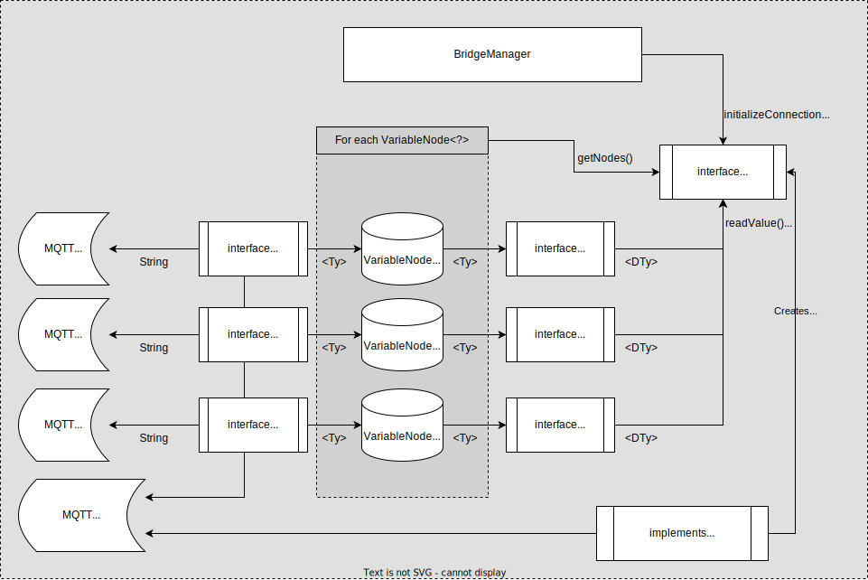

# Supporting new devices

For the purpose of supporting a new device, mqttbridge acts as a framework that will take care of synchronizing data between MQTT and the device. We only need to specify what kind of data the device exposes, how to read/write (if supported, be notified of changes) and how to convert between data in memory to mqtt and device calls.

A few generic types are used, as follows:

| Generic Type | Meaning                                                                                                           | Scope        |
|--------------|-------------------------------------------------------------------------------------------------------------------|--------------|
| Ty           | The java type of a variable. Can `Integer`, `Float`, `String` or really anything that we can convert to and from. | Per-variable |
| DTy          | The data type that is used in write and read call with the device. Usually is a String, or JSON structure         | Global       | 
| DCTy         | The class that defines the structure of the `device` section in the configuration file                            | Global       | 

We need to implement the following classes:
* `DevicePropertiesInterface` is reponsible with configuring the call interface and metadata for Home Assistant Discovery. Typically, here we would create the list of `VariableNode<?>` for our device.
* `DeviceCallInterface` is the interface responsible for reading and writing variables to our device. There is also support for device sending notifications about variable changes.
    * Methods `readValue`, `writeValue` and `notifyValue` are used to exchange data with the device
    * Methods `initializeConnection`, `closeConnection`, `isOpen` and `isOpenStream` are used to manage the lifetime of the connection to the device.
* `VariableNode` is an abstract class that holds the current value of the variable being synced. It also contains the field `deviceKey` that used to identity the variable being queried in `DeviceCallInterface`. Usually, there is no need other than extend (and parametrize Ty) the class and provide an all-argument constructor. It can also hold be extended with extra flags and arguments that `DeviceCallInterface` might need to properly interface the device.
* `DeviceAdapter` converts back and forth between variable value type (`Ty`) and read/write call content (`DTy`)
* `MqttAdapter` converts back and forth between variable value type (`Ty`) and MQTT values (`String`). This class also handles augmenting Home Assistant Discovery with variable-specific properties. There are a few implementations available for most-used data types.